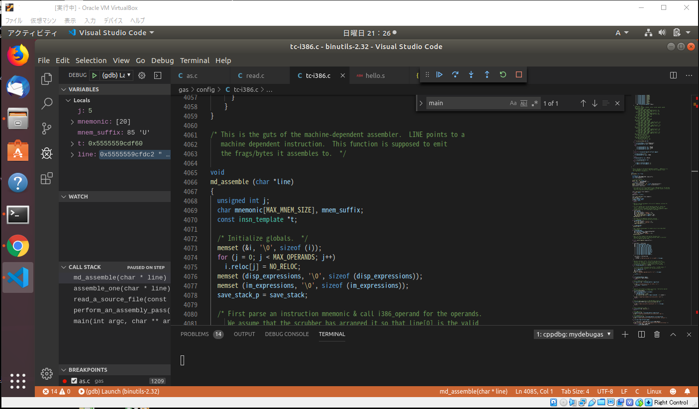

# Binutils_memo
 
参考になるページ

https://sourceware.org/binutils/binutils-porting-guide.txt


## デバッグ環境を整える。

### binutils 

https://www.gnu.org/software/binutils/

binutils-2.32.tar.gz をダウンロード

makeは以下を実行。\<INSTALL PATH\> , \<PREFIX\> は適当に設定。

```
$ tar -zxvf binutils-2.32.tar.gz
$ cd binutils-2.32
$ mkdir buile_debug
$ ../configure --prefix=<INSTALL PATH> --program-prefix=<PREFIX> $ CFLAGS="-g3 -O0"
$ make
$ sudo make install
```

### sample code 

以下を参考に hello.sを作成

https://cs.lmu.edu/~ray/notes/gasexamples/

```s
        .global _start

        .text
_start:
        # write(1, message, 13)
        mov     $1, %rax                # system call 1 is write
        mov     $1, %rdi                # file handle 1 is stdout
        mov     $message, %rsi          # address of string to output
        mov     $13, %rdx               # number of bytes
        syscall                         # invoke operating system to do the write

        # exit(0)
        mov     $60, %rax               # system call 60 is exit
        xor     %rdi, %rdi              # we want return code 0
        syscall                         # invoke operating system to exit
message:
        .ascii  "Hello, world\n"
```

### Visual Studio Code


.vscode/launch.json の内容を以下のように記載。

\<INSTALL PATH\> , \<PREFIX\> は configureときに指定したもの。
\<PATH\>　は hello.sを置いたパス。


```json
{
    // Use IntelliSense to learn about possible attributes.
    // Hover to view descriptions of existing attributes.
    // For more information, visit: https://go.microsoft.com/fwlink/?linkid=830387
    "version": "0.2.0",
    "configurations": [
        {
            "name": "(gdb) Launch",
            "type": "cppdbg",
            "request": "launch",
            "program": "<INSTALL PATH>/<PREFIX>as",
            "args": ["<PATH>/hello.s"],
            "stopAtEntry": false,
            "cwd": "${workspaceFolder}",
            "environment": [],
            "externalConsole": false,
            "MIMode": "gdb",
            "setupCommands": [
                {
                    "description": "Enable pretty-printing for gdb",
                    "text": "-enable-pretty-printing",
                    "ignoreFailures": true
                }
            ]
        }
    ]
}
```

### Debug 実行

